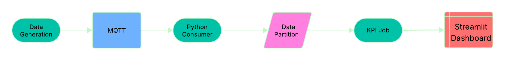
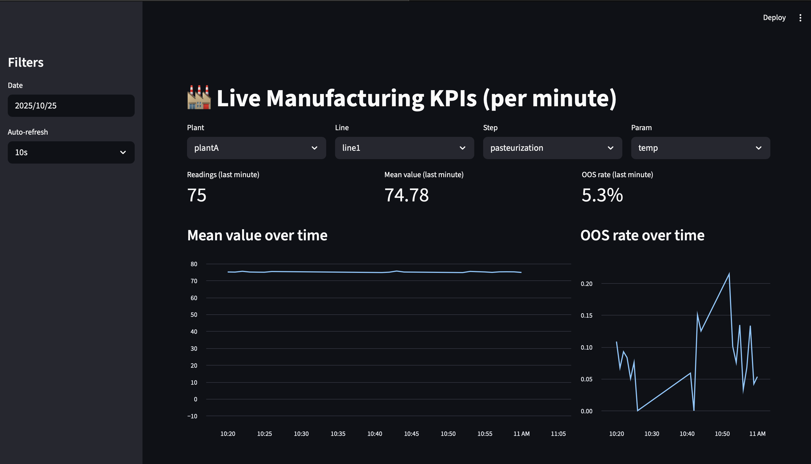

# Real-Time Manufacturing ETL (MQTT → Parquet → KPIs → Streamlit)

**What it does:** Ingests live sensor data, validates it, stores it as Parquet, computes per-minute KPIs (mean, OOS%), and visualizes live metrics in Streamlit.

## Architecture
MQTT (Mosquitto) → Python Consumer → Parquet (partitioned by date) → KPI job → Streamlit Dashboard  


## Quickstart (5 steps)
```bash
git clone git@github.com:Poojabumesh/flavormetrics.git
cd flavormetrics
make venv
make up                     # start MQTT broker
make ingest &               # start parquet consumer (buffer + write)
make sim                    # run sensor simulator (in another terminal)
make dash                   # open Streamlit dashboard

##Components
• src/simulator.py — publishes fake sensor readings (temp)
• src/consumer_parquet.py — subscribes, flags in-spec, writes data/raw/date=YYYY-MM-DD/part-*.parquet
• src/kpi_minute.py — aggregates per-minute KPIs → data/marts/
• src/app.py — Streamlit dashboard (auto-refresh)

##Why these choices?
• MQTT: lightweight pub/sub for device-style telemetry
• Parquet: columnar, efficient analytics store (fastparquet engine)
• Pandas: rapid transforms + grouping for KPIs
• Streamlit: fast, shareable dashboards

##Extend to Production
• Swap MQTT→Kafka, Parquet→Delta/Iceberg or Snowflake (Snowpipe Streaming), add dbt/Great Expectations, and CI/CD.

##Dashboard
**Streamlit Dashboard Screenshots:**




##License
 MIT — free for commercial and personal use.
