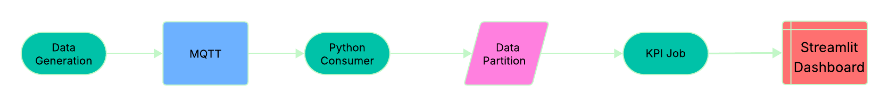

# 🧠 FlavorMetrics

**AI-powered Manufacturing Intelligence Platform**  
Bringing predictive analytics, data automation, and real-time optimization to food and beverage production lines.

---

## 🚀 Overview

FlavorMetrics is a collection of **end-to-end data and AI systems** designed for manufacturing environments — from IoT sensor ingestion to predictive analytics and visualization.

The goal: help plants **improve yield, reduce waste, and make smarter operational decisions** through live data, AI models, and intuitive dashboards.

---

## 🏗️ Core Modules

| Module | Description | Tech Stack |
|--------|--------------|-------------|
| [`ETL_pipeline`](./ETL_pipeline) | Real-time ETL pipeline for ingesting, validating, and visualizing manufacturing sensor data. | Python, MQTT (Mosquitto), Parquet, Pandas, Streamlit |
| `modeling/` *(coming soon)* | Predictive modeling & optimization — suggest “next-best-action” adjustments to keep parameters within limits. | Scikit-learn, PyTorch, MLflow |
| `analytics/` *(planned)* | Advanced analytics layer for KPI trends, yield prediction, and process optimization. | dbt, Snowflake, Power BI / Streamlit |
| `deployment/` *(planned)* | MLOps and CI/CD integration for scalable production deployments. | Docker, Kubernetes, GitHub Actions |

---

## 🧩 Architecture Vision

End-to-end system flow:

**Sensors / Machines → Edge Gateway → MQTT Broker → ETL (Python) → Parquet / Snowflake → KPI / AI Models → Dashboard**

---

## 💡 Key Features

- **Real-Time Data Ingestion** – From IoT sensors or simulated streams  
- **Automated KPI Computation** – Mean, out-of-spec %, trends  
- **Interactive Dashboards** – Live Streamlit analytics interface  
- **Extendable ETL Core** – Ready to integrate with Kafka, Snowflake, or dbt  
- **Future: Predictive & Prescriptive Models** – Suggest corrective actions for process parameters

---

## 🧰 Tech Stack

**Languages & Frameworks:** Python, Pandas, Streamlit, PyTorch  
**Data Layer:** MQTT, Parquet (Fastparquet), Snowflake *(planned)*  
**MLOps Tools:** MLflow, Docker, Kubernetes *(planned)*  
**Visualization:** Streamlit, Plotly  

---

## 🔗 Repositories & Submodules

- [ETL Pipeline →](./ETL_pipeline)  
  Live data ingestion and visualization demo.

---

## 🧭 Roadmap

✅ Phase 1 — Real-time ETL + KPI Visualization  
🧪 Phase 2 — Predictive & Prescriptive Models (optimization layer)  
☁️ Phase 3 — Cloud-native Deployment (K8s + Snowflake + dbt)

---

## 📜 License

**MIT License** — free for personal and commercial use.

---
